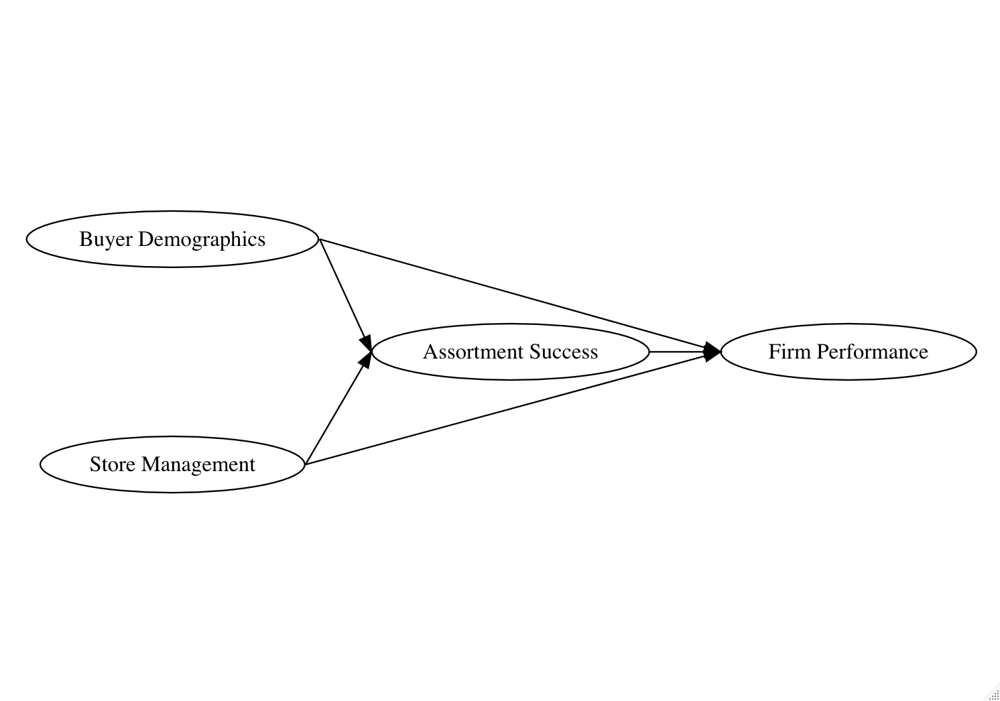
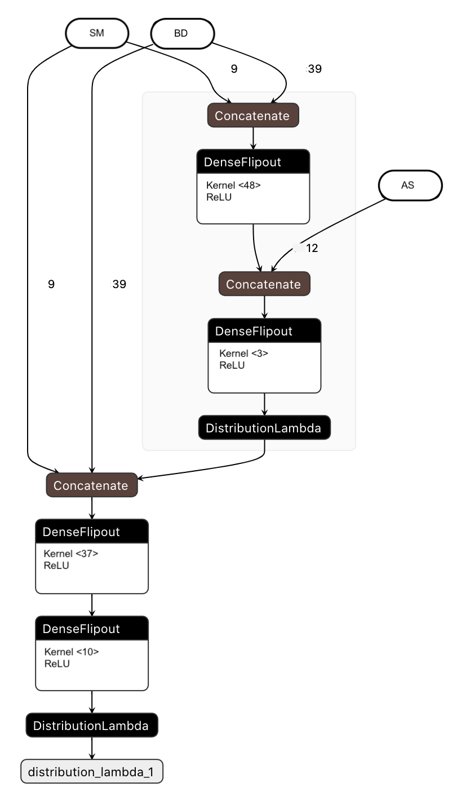

# Loss convergence in a causal Bayesian neural network of retail firm performance

Most causal relationships in machine learning are direct, i.e. all the features predict with no relationship to each other. But what about more complicated causal relationships, such as this?

Structural equation modeling provides a means of estimating such relationships. In the example of my [research](https://www.koreascience.or.kr/article/JAKO201816357066272.page), co-authored with Professors Youngjin Bahng and Doris Kincaid, the model from that diagram was estimated as an SEM model:

In [arXiv 2008.13038](https://arxiv.org/abs/2008.13038), I take that structural model and turn it into the following [causal Bayesian neural network](https://www.quantamagazine.org/to-build-truly-intelligent-machines-teach-them-cause-and-effect-20180515/):

Why? The processing of tuning such a neural network can reveal much about the relationship between the features and firm performance. If hyperparameter tuning chooses neural network layer densities that are wider than the number of features in a particular node, then that indicates greater aleotoric uncertainty, and that prediction might improve with the addition of other features. In domains such as alternative data for investments and [other areas](https://youtu.be/DEHqIxX1Kq4) [of finance](https://youtu.be/LlzVlqVzeD8), that can indicate causal indicators that could use additional research.

It can also provide estimates of the uncertainty in prediction. This research shows that removing the SEM node with the weakest causal connection to firm performance speeds up the time to finding those estimates when uncertainty is added to the neural network using the Kullback-Leibler divergence. The code uses version 0.7.0 of Tensorflow-probability.
